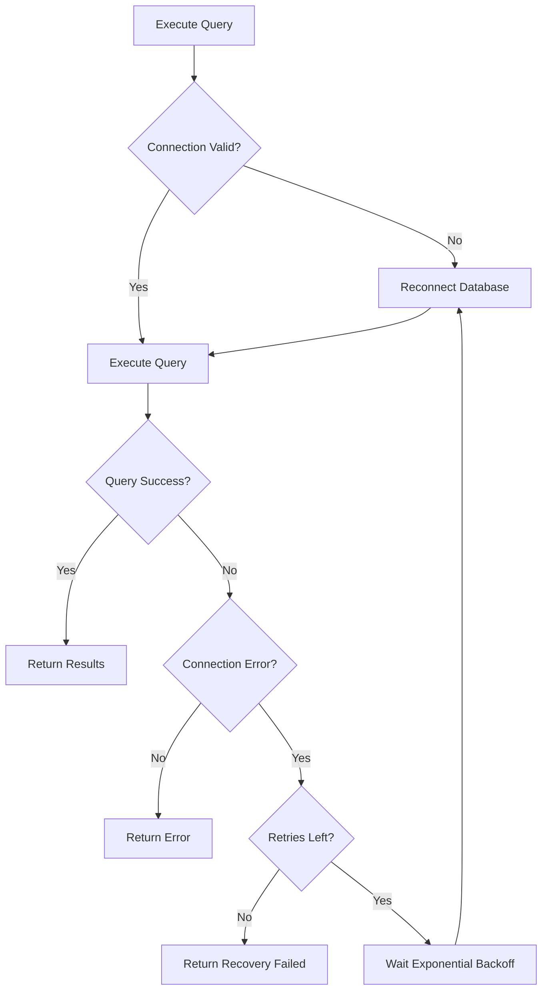

# Connection Recovery and Error Handling

The Kuzu MCP Server includes robust connection recovery mechanisms to handle database connection failures and provide resilient operation for AI agents.

## Overview

Database connections can fail for various reasons:
- Network interruptions
- Database server restarts
- Resource exhaustion
- DDL operation timeouts (specific to Kuzu bug)
- Process-level crashes

The server automatically detects these failures and attempts recovery without requiring a full restart of Claude Desktop.

## Recovery Mechanisms

### 1. Connection Health Monitoring

The server continuously monitors connection health using a simple test query:

```sql
RETURN 1 as test;
```

This validation occurs:
- Before executing any query (if previous errors occurred)
- After connection errors are detected
- During retry attempts

### 2. Automatic Reconnection

When connection failures are detected, the server:

1. **Discards** old connection references (Kuzu doesn't have close() methods)
2. **Creates** new Database and Connection instances
3. **Validates** the new connection works
4. **Retries** the original query

### 3. Retry Logic with Exponential Backoff

The server implements intelligent retry logic:

- **Configurable retry attempts** (default: 2 retries + initial attempt = 3 total)
- **Exponential backoff** between attempts: 1s, 2s, 4s (capped at 5s)
- **Only retries connection-related errors** (not syntax or logic errors)

## Configuration

### Environment Variables

```bash
# Maximum retry attempts for connection errors (default: 2)
export KUZU_MAX_RETRIES=3

# Multi-agent coordination settings
export KUZU_MULTI_AGENT=true
export KUZU_AGENT_ID=agent-1
export KUZU_LOCK_TIMEOUT=10000

# Database settings
export KUZU_READ_ONLY=true
export KUZU_MCP_DATABASE_PATH=/path/to/database
```

### Retry Configuration Examples

```bash
# Conservative: 1 retry (2 total attempts)
export KUZU_MAX_RETRIES=1

# Standard: 2 retries (3 total attempts) - DEFAULT
export KUZU_MAX_RETRIES=2

# Aggressive: 4 retries (5 total attempts)
export KUZU_MAX_RETRIES=4
```

## Error Types and Handling

### Connection Errors (Retryable)

These errors trigger automatic recovery:

- `Connection` - Database connection lost
- `Database` - Database instance errors  
- `closed` - Connection has been closed
- `getAll timeout` - DDL operation timeout (Kuzu bug workaround)

### Non-Connection Errors (Not Retryable)

These errors are returned immediately without retry:

- Syntax errors
- Constraint violations
- Permission errors
- Business logic errors

## Recovery Flow



## Error Responses to LLM

### Successful Recovery

When recovery succeeds, the LLM receives normal query results with optional attempt information in logs.

### Recovery Failure

When all recovery attempts are exhausted, the LLM receives a structured error:

```json
{
  "error": "CONNECTION_RECOVERY_FAILED",
  "message": "Database connection could not be restored after 3 attempts. The MCP server may need to be restarted.",
  "type": "connection_failure",
  "attempts": 3,
  "maxRetries": 3,
  "lastError": "Database connection closed during query execution",
  "suggestion": "Please restart Claude Desktop or check the database server status.",
  "recovery": "Connection recovery failed after multiple attempts"
}
```

This gives the LLM clear information about:
- **What happened** (connection recovery failed)
- **How many attempts** were made
- **What the last error was**
- **What actions to take** next

## Process-Level Error Handling

The server also handles process-level errors that could crash the MCP connection:

### Uncaught Exceptions

```javascript
process.on("uncaughtException", (error) => {
  console.error("Uncaught Exception:", error)
  // Discard connection references
  // Continue running (don't exit)
})
```

### Unhandled Promise Rejections

```javascript
process.on("unhandledRejection", (reason, promise) => {
  console.error("Unhandled Rejection:", reason)
  // Log error but continue running
})
```

## DDL Timeout Workaround

The server includes a specific workaround for a Kuzu bug where `getAll()` hangs on DDL operations:

```javascript
const rows = await Promise.race([
  result.getAll(),
  new Promise((_, reject) => 
    setTimeout(() => reject(new Error("getAll timeout")), 5000)
  )
])
```

This timeout is treated as a connection error and triggers recovery.

## Monitoring and Logging

### Recovery Attempts

```
Attempt 1/3: Checking connection health...
Connection invalid, attempting to reconnect...
Waiting 1000ms before retry...
Attempt 2/3 failed: Database connection closed
Will retry connection error (attempt 2/3)
Query succeeded on attempt 3
```

### Connection Validation

```
Connection validation failed: Error details here
Attempting to reconnect to database...
Database reconnection successful
```

### Recovery Failure

```
Retry failed after reconnection: Final error details
CONNECTION_RECOVERY_FAILED: Database connection could not be restored after 3 attempts
```

## Best Practices

### For Users

1. **Set appropriate retry limits** for your environment:
   - Local development: `KUZU_MAX_RETRIES=1` (fast feedback)
   - Production: `KUZU_MAX_RETRIES=3` (more resilient)

2. **Monitor logs** for connection issues to identify patterns

3. **Use read-only mode** when possible to reduce connection stress

### For Developers

1. **Test connection recovery** during development:
   ```bash
   # Simulate connection issues
   kill -STOP $KUZU_PID  # Pause database
   # Execute queries (should recover)
   kill -CONT $KUZU_PID  # Resume database
   ```

2. **Handle recovery errors** gracefully in client code

3. **Consider retry costs** when setting `KUZU_MAX_RETRIES`

## Troubleshooting

### Common Issues

**Problem**: Recovery keeps failing
- **Solution**: Check database server status and disk space

**Problem**: Too many retry attempts
- **Solution**: Reduce `KUZU_MAX_RETRIES` or fix underlying connection issues

**Problem**: Slow query execution during recovery
- **Solution**: Exponential backoff is working as designed; consider faster database

### Debug Information

Enable detailed logging by checking server console output for:
- Connection validation attempts
- Reconnection success/failure
- Retry attempt details
- Final error messages

## Related Documentation

- [Multi-Agent Coordination](./Multi-Agent%20Coordination%20Design%20for%20kuzudb-mcp-server.md) - For concurrent access patterns
- [Batch Query Improvements](./batch-query-improvements.md) - For DDL handling
- [KUZU_BUG_WORKAROUNDS.md](../kuzu-bug-report/KUZU_BUG_WORKAROUNDS.md) - For specific bug workarounds